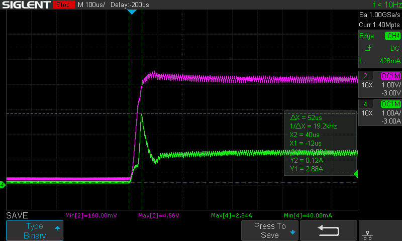
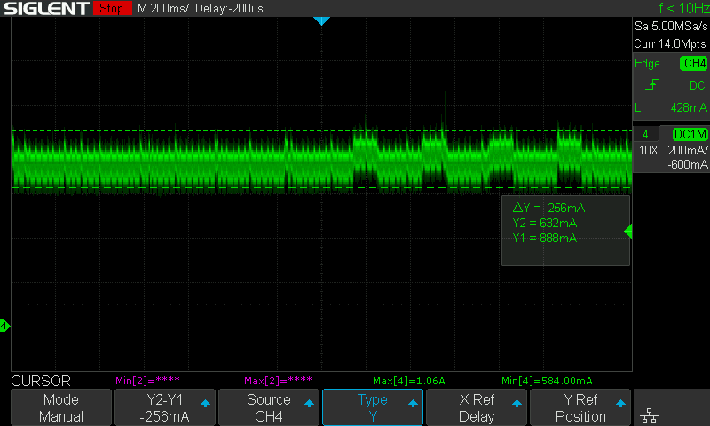

# Strommessungen - HW Rev 1

## Einschaltstrom ohne Akku

## Einschaltstrom mit Akku

## Verbrauch

### Sleep ohne laden
22mA @5V

Gleiche Firmware anderes board (mit Linearregler):  
4mA @5V

### Sleep mit laden
417mA @5V

### Aktiv leise ohne laden

### Aktive laut ohne laden

## Startsequenz einzeln

### Start - nichts initialisiert

52mA @5V

- i2c noch nicht initialisiert
- power save 3v3V immernoch ein

### Nach ESP wakeup check 

73mA @5V

- i2c Initialisiert und VCC PowerSave off

### Nach SD Karte

75mA @5V

- SD initialisiert und user config geladen

### Nach HBI ein

80mA @5V

- HBI initialisiert

### Nach Audio ein und 12V ein

562mA @5V

- Audio initialisiert 
- NPDN vom 12V booster on

### Nach WiFi ein

Kurzzeitige Peaks zu 600mA @5V

- Wifi verbunden
