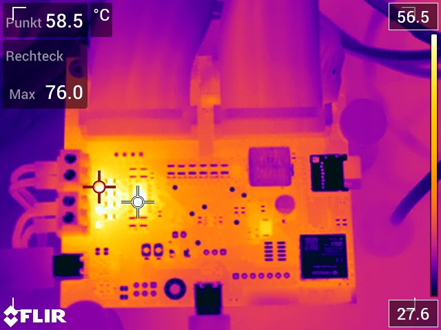
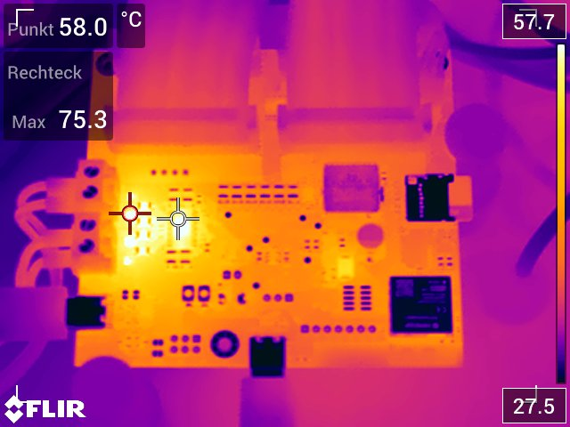
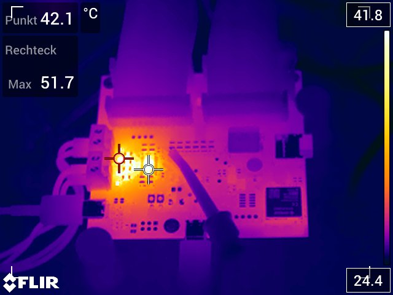
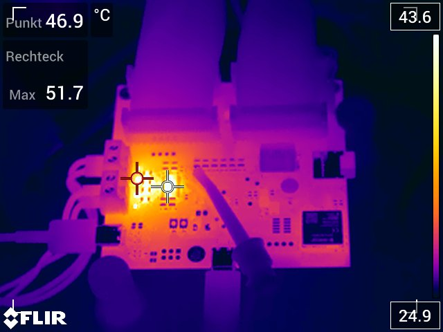
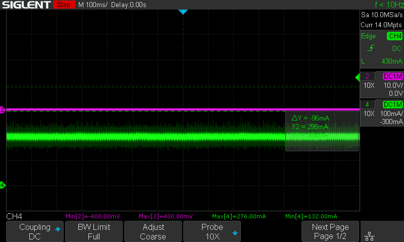
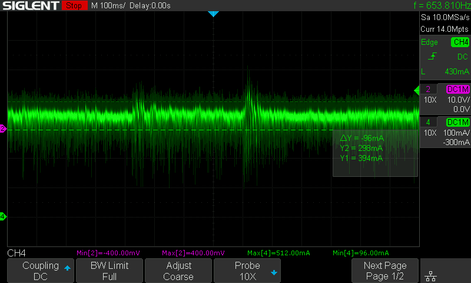
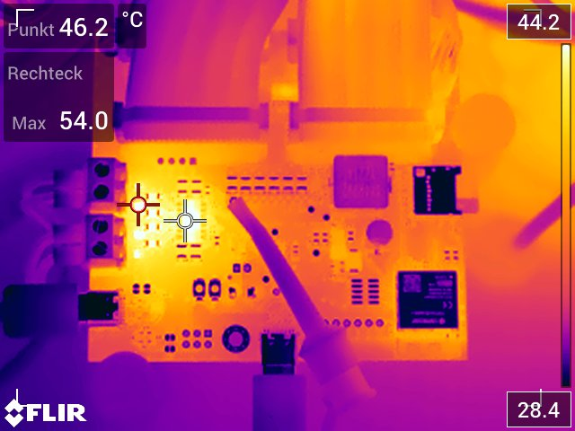
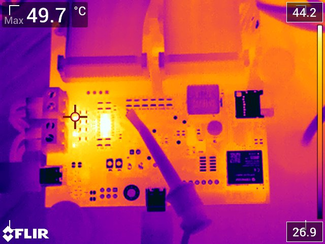
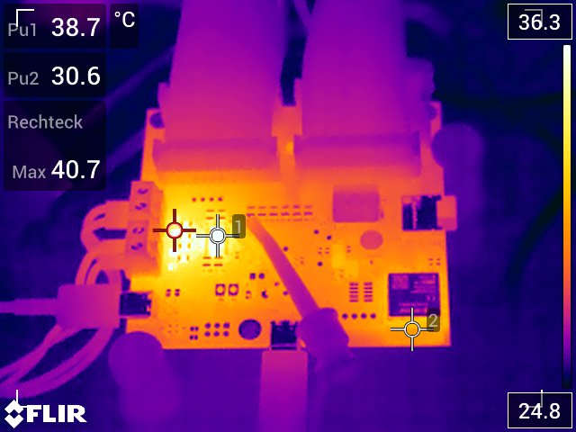
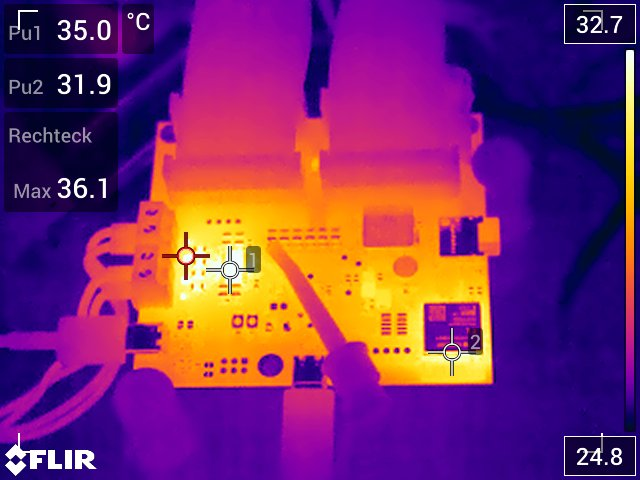

# Codec Temperatur und Strom bei verschiedenen Spannungen

## VAudio = 12V

Bei 384kHz

Bei 768kHz

### Stromaufnahme Codec
183 mA @12V = 2.2W

## VAudio = 9V

Leise

Laut

### Stromaufnahme Codec

Leise
PSU: 147mA @9V

Oszibild (Peaks: 132mA - 276mA):

Laut
PSU: 200mA @9V

Oszibild (Peaks: 96mA - 512mA):

## VAudio = 8V

Leise

Laut

### Stromaufnahme Codec
134 mA @8V = 1.07W

## VAudio = 7V

Leise

### Stromaufnahme Codec
122mA @7V

## VAudio = 5V

Leise

### Stromaufnahme Codec
97mA @5V
